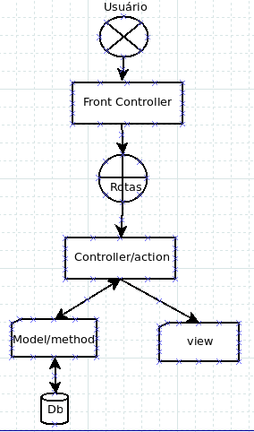

# Roteamento

Roteamento é o processo de analisar um URI e determinar a ação apropriada a ser tomada.

## Por exemplo

http://localhost/cadastro/clients/edit/38

## Fluxo de informações do MVC

- User faz a requisição da URI acima
- A requisição é recebida pelo Front Controller
- Front controller envia para o Router
- Router envia para o action edit, com parâmetro 38 do controller ClientsController
- O Controller via seu action solicita as informações do método edit do ClientModel
- O método edit do Model solicita ao Database as alterações
- O Database altera e devolve o resultado para o método edit do ClientModel
- O Model via edit devolve para o ClientsController
- O ClientsController devolve o resultado já alterado para a view clients/edit com registro 38



## .htaccess

Geralmente os sistemas de rotas são auxiliados por um arquivo de configuração do Apache, o .htaccess, para redirecionar as requisições.

Como este
```bash
RewriteEngine On
RewriteCond %{REQUEST_FILENAME} !-d
RewriteCond %{REQUEST_FILENAME} !-f
RewriteCond %{REQUEST_FILENAME} !-l
RewriteRule ^(.+)$ index.php?url=$1 [QSA,L]
```

No contexto de um aplicativo Web do lado do servidor, um sistema de roteamento é a parte do aplicativo Web que mapeia uma solicitação HTTP para um manipulador de solicitação (função/método). Uma solicitação HTTP consiste em um cabeçalho/head e, opcionalmente, um corpo/body. O cabeçalho contém informações sobre a solicitação, por exemplo, o método, o caminho e o host. Alguns métodos como GET, HEAD e OPTIONS não usam o corpo da solicitação, enquanto outros como POST, PUT e PATCH o usam para passar dados de um cliente para um servidor.

O uso de um sistema de roteamento nos permite estruturar melhor nossa aplicação em vez de designar cada solicitação a um arquivo.

Um sistema de roteamento funciona mapeando uma solicitação HTTP para um manipulador de solicitação com base no método de solicitação e no caminho especificado na URL da solicitação. Isso é exatamente o que vamos construir neste tutorial.

## Referências

https://medium.com/the-andela-way/how-to-build-a-basic-server-side-routing-system-in-php-e52e613cf241

https://dev.to/shoaiyb/building-a-php-routing-system-54g5
